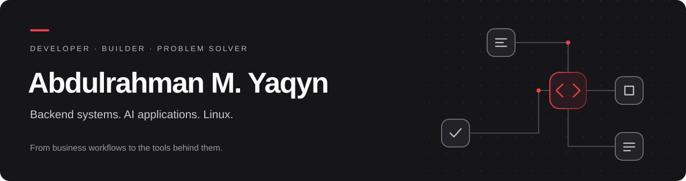
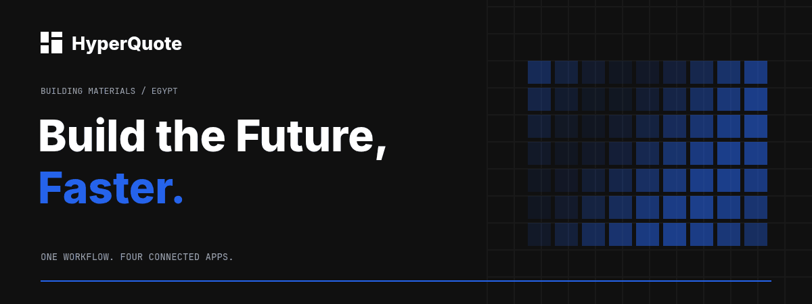
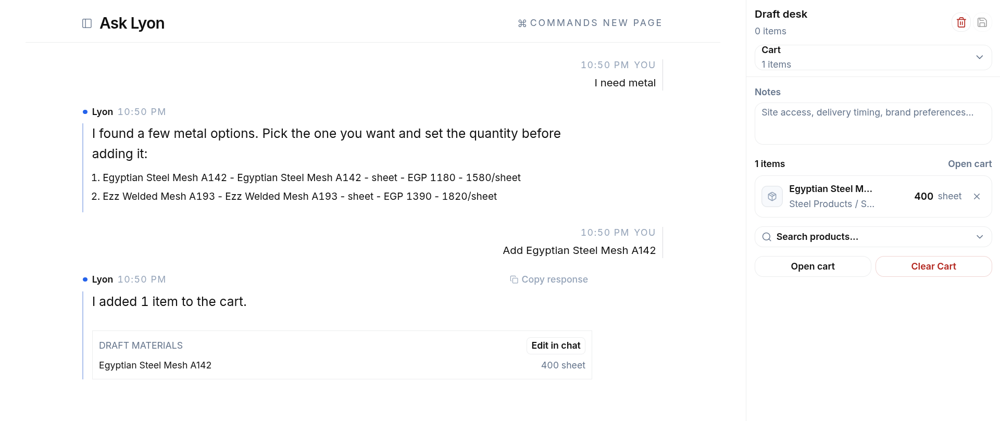

  <a href="mailto:contact@yaqyn.dev">Contact</a> &nbsp;·&nbsp;
  <a href="https://github.com/yaqyn/HyperQuote">HyperQuote</a> &nbsp;·&nbsp;
  <a href="https://github.com/yaqyn/qvOS">qvOS</a> &nbsp;·&nbsp;
  <a href="https://www.boot.dev/u/yaqyn">Boot.dev</a>

## Building useful software, from the workflow to the system

I'm **Abdulrahman M. Yaqyn**, a developer based in **6th of October City, Egypt**. I work on backend systems, practical AI applications, and automation, with hands-on experience building connected business software and my own Arch Linux distribution.

My accounting background shapes how I approach development: understand the operation, follow the data, and build tools that make the work easier. I enjoy turning complex processes into clear interfaces and connected systems.

## Selected work

### HyperQuote · Connected business operations

**Six months of continuous AI-assisted full-stack development.** A digital ecosystem connecting customers, sales, internal operations, management, dispatch, and drivers, from a material request to its delivery.

- Connected orders, inventory, suppliers, warehousing, fleet, finance, and customer service workflows.
- Built natural-language ordering and a RAG-based assistant for accessing company information.
- Developed customer, operations, and driver experiences around shared data and coordinated handoffs.

**Stack:** Supabase · PostgreSQL · Cloudflare Workers · TypeScript (AI-assisted) · Motion · Adobe Aria · Infisical

[Explore the project](https://github.com/yaqyn/HyperQuote) · [Visit the website](https://www.hyperquote.net) · [Customer portal](https://portal.hyperquote.net)

<strong>See the customer experience</strong>

 

### qvOS · A personal Linux distribution

**Ongoing development and customization.** My standalone Arch Linux distribution brings together a keyboard-first Hyprland desktop, native system tools, installation, updates, and recovery workflows.

starting as a fork of dhh's Omacom, I build and adapt it around my own development, productivity, automation, and AI agent workflows. It's where my interest in Linux, interface design, and practical tooling comes together.

**Focus:** Arch Linux · Hyprland · Command-line tools · Desktop integration · Automation

[Explore qvOS](https://github.com/yaqyn/qvOS) · [Read about the architecture](https://github.com/yaqyn/qvOS/blob/OS/qvcore/README.md)

### Python projects · Building the fundamentals

Alongside larger projects, I practice software fundamentals through smaller, focused builds.

| Project | What it explores |
| --- | --- |
| [Workbench — AI Coding Agent](https://github.com/yaqyn/workbench-ai-agent) | Workspace-scoped coding agents |
| [SiteLens — Web Crawler](https://github.com/yaqyn/sitelens-web-crawler) | Web scraping, HTTP, and automation |
| [Folio — Personal Site & Generator](https://github.com/yaqyn/folio-static-site) | Turning Markdown into a website |
| [Orbit — Asteroids Game](https://github.com/yaqyn/orbit-asteroids-game) | Game logic and object-oriented programming |
| [TextScope — Text Analyzer](https://github.com/yaqyn/textscope-text-analyzer) | Python text processing |

## Skills & tools

| Area | Skills |
| --- | --- |
| **Programming** | Python, SQL, object-oriented and functional programming, data structures and algorithms |
| **Backend & data** | APIs and HTTP, database development, PostgreSQL, Supabase, Pandas, Polars, data analysis and visualization |
| **AI & automation** | LLM applications, RAG, AI agents, agentic workflows, prompt engineering, web scraping, workflow automation |
| **Development** | Git, Linux, command-line tools, debugging, AI-assisted software development |
| **Business & design** | AI strategy and adoption, Adobe graphic design, Google Workspace |

### How I work with AI

I use **Claude Code and Codex** throughout development for implementation, debugging, and code review. My workflow combines detailed prompts, iterative review, and human decision-making. I focus on understanding the requirements, evaluating the generated work, and checking how the pieces behave together.

## Learning & credentials

I'm strengthening my backend foundations through **Boot.dev and IBM**, studying **Go, JavaScript, and TypeScript**, and expanding into **AWS and cloud engineering**. My current learning also includes frontend development with **Scrimba**, full-stack development with **Meta and Scrimba**, and AI engineering with **IBM and Scrimba**.

<strong>Professional certificates & AI training</strong>

- **Microsoft AI for Developers Professional Certificate** — Microsoft
- **Microsoft AI Business Professional Certificate** — Microsoft
- **Adobe Graphic Designer: Design that Demands Attention Professional Certificate** — Adobe
- **Generative AI Leader Professional Certificate** — Google Cloud
- **Google AI Professional Certificate** — Google
- **AI Fluency** — Anthropic

Additional learning: responsible AI with Google, AI-powered business workflows with Microsoft, and AI-assisted research and problem-solving with Google.

**Bachelor of Business Science in Accounting**  
Akhbar Al Youm Academy · 6th of October City, Egypt  
Four-year program · Final-year grade: **Excellent (امتياز)**

---

**Have a role or project in mind?** I'm interested in backend development, AI applications, and business workflow automation. Reach me at **[contact@yaqyn.dev](mailto:contact@yaqyn.dev)**.
