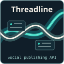
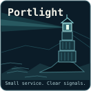
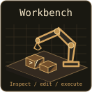
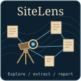
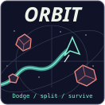
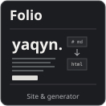

  <a href="mailto:contact@yaqyn.dev">Contact</a> &nbsp;·&nbsp;
  <a href="https://yaqyn.github.io/folio-static-site/">Portfolio</a> &nbsp;·&nbsp;
  <a href="https://github.com/yaqyn/HyperQuote">HyperQuote</a> &nbsp;·&nbsp;
  <a href="https://github.com/yaqyn/qvOS">qvOS</a> &nbsp;·&nbsp;
  <a href="https://www.boot.dev/u/yaqyn">Boot.dev</a>

##  Backend systems, AI applications, and Linux

I'm **Abdulrahman M. Yaqyn**, a developer based in **6th of October City, Egypt**. I build backend systems, AI applications, and Linux tools. My work includes HyperQuote’s business software, my personal Linux distribution qvOS, and Go and Python projects developed through Boot.dev.

> Understand the work. Follow the data. Make the behavior clear.

My accounting background makes me attentive to how records, responsibilities, and handoffs fit together. I approach software by understanding the work first, then shaping the data and interfaces around it.

##  Career Projects

###  HyperQuote — Connected Business Operations

  

**Business software for building-materials procurement.** I develop HyperQuote to connect customers, sales, operations, dispatch, and drivers across the path from a material request to delivery.

- Connected orders, inventory, suppliers, warehousing, fleet, finance, and customer service workflows.
- Built natural-language ordering and a RAG-based assistant for accessing company information.
- Developed customer, operations, and driver experiences around shared data and coordinated handoffs.

**Stack:** TypeScript · React · TanStack Start · Supabase · PostgreSQL · Cloudflare Workers · Infisical

[Explore the project](https://github.com/yaqyn/HyperQuote) · [Visit the website](https://www.hyperquote.net) · [Customer portal](https://portal.hyperquote.net)

##  Personal Projects

###  qvOS — Personal Linux Distribution

  

**An ongoing Arch Linux distribution project.** I develop qvOS around a keyboard-first Hyprland desktop, native system tools, and the practical work of installation, updates, and recovery.

qvOS began with [Omarchy](https://github.com/basecamp/omarchy). I adapt and extend it for my own development, productivity, automation, and AI agent workflows. Working on the system I use every day gives those decisions a direct test.

**Focus:** Arch Linux · Hyprland · Command-line tools · Desktop integration · Automation

[Explore qvOS](https://github.com/yaqyn/qvOS) · [Read about the architecture](https://github.com/yaqyn/qvOS/blob/OS/qvcore/README.md)

##  Learning Journey

**Projects developed through the [Boot.dev](https://www.boot.dev) curriculum and extended through independent work.** They cover Go and Python APIs, containerized services, retrieval systems, and developer tools. Each repository documents what it does and how to run it.

| Project | Engineering focus |
| --- | --- |
| [Threadline — Social Publishing API](https://github.com/yaqyn/threadline-social-api) | Go and PostgreSQL APIs, authentication, renewable sessions, and membership webhooks |
| [Portlight — HTTP Server](https://github.com/yaqyn/portlight-http-server) | Docker builds, health probes, structured logs, and graceful shutdown in Go |
| [Workbench — AI Coding Agent](https://github.com/yaqyn/workbench-ai-agent) | Workspace-scoped coding agents and tool boundaries |
| [CineSearch — Movie RAG Engine](https://github.com/yaqyn/cinesearch-rag-engine) | BM25, semantic retrieval, hybrid ranking, and grounded generation |
| [SiteLens — Web Crawler](https://github.com/yaqyn/sitelens-web-crawler) | HTTP, asynchronous crawling, and structured reports |
| [Orbit — Asteroids Game](https://github.com/yaqyn/orbit-asteroids-game) | Game logic and object-oriented programming |
| [TextScope — Text Analyzer](https://github.com/yaqyn/textscope-text-analyzer) | Text processing, vocabulary analysis, and exports |
| [Folio — Personal Site & Generator](https://github.com/yaqyn/folio-static-site) | Markdown parsing, HTML generation, and static-site publishing |

##  Skills & tools

| Area | Skills |
| --- | --- |
| **Programming** | Go, Python, SQL, object-oriented and functional programming, data structures and algorithms |
| **Backend & data** | APIs and HTTP, database development, PostgreSQL, Supabase, Pandas, Polars, data analysis and visualization |
| **AI & automation** | LLM applications, RAG, AI agents, agentic workflows, prompt engineering, web scraping, workflow automation |
| **Development** | Git, Linux, Docker, Docker Compose, command-line tools, debugging, AI-assisted software development |
| **Business & design** | AI strategy and adoption, Adobe graphic design, Google Workspace |

###  How I work with AI

I use **Claude Code and Codex** for implementation, debugging, and code review. I define the requirements, review changes, and check behavior through tests and direct use. The tools help me explore and build; the decisions and responsibility for the work remain mine.

##  Learning & credentials

My current study covers backend development through **Boot.dev and IBM**, **Go, JavaScript, and TypeScript**, and **AWS and cloud engineering**. I also study frontend development with **Scrimba**, full-stack development with **Meta and Scrimba**, and AI engineering with **IBM and Scrimba**.

<strong>Professional certificates & AI training</strong>

- **Microsoft AI for Developers Professional Certificate** — Microsoft
- **Microsoft AI Business Professional Certificate** — Microsoft
- **Adobe Graphic Designer: Design that Demands Attention Professional Certificate** — Adobe
- **Generative AI Leader Professional Certificate** — Google Cloud
- **Google AI Professional Certificate** — Google
- **AI Fluency** — Anthropic

Additional learning: responsible AI with Google, AI-powered business workflows with Microsoft, and AI-assisted research and problem-solving with Google.

**Bachelor of Business Science in Accounting**  
Akhbar Al Youm Academy · 6th of October City, Egypt  
Four-year program · Final-year grade: **Excellent (امتياز)**

---

**Let’s talk about the work.** For roles or projects involving backend development, AI applications, or business workflow automation, reach me at **[contact@yaqyn.dev](mailto:contact@yaqyn.dev)**.

##  Project gallery

<strong>Explore the eight Boot.dev projects</strong>

  
  
  
  
  
  
  
  

